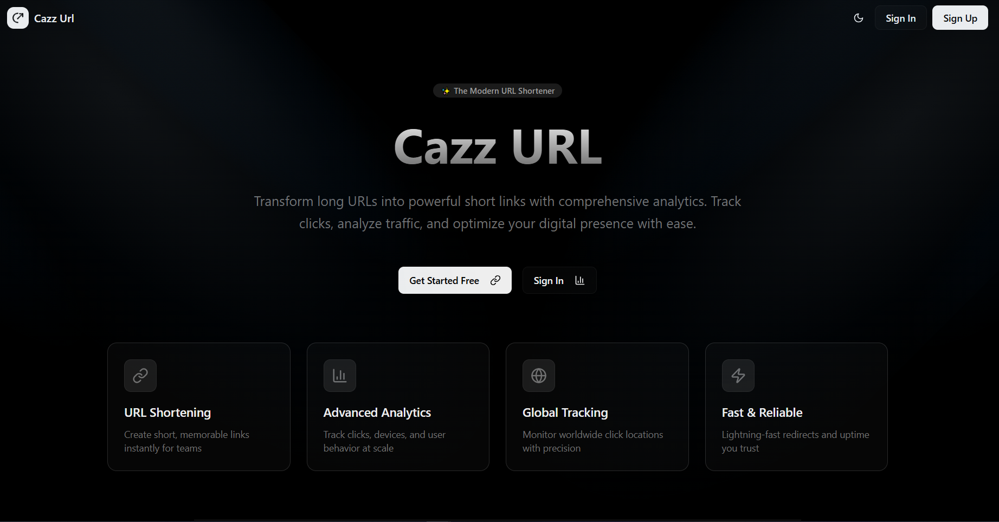

<p align="center">
  
  
</p>

<h1 align="center">Cazz URL — Shorten • Track • Grow</h1>

<p align="center">A modern URL shortener with rich analytics, built with Next.js, MongoDB, and Clerk.</p>

<p align="center">
	
</p>

## Overview

Cazz URL lets you create short links and understand your audience with actionable analytics. Auth is handled by Clerk, data is stored in MongoDB via Mongoose, and the app uses the Next.js App Router.

## Features

- Short, memorable links with unique short codes
- Link management: create, edit, delete, list
- Analytics per link: clicks over time, device types, referrers, top countries/cities, and user agent summary
- Server-side redirect for short codes with pre-redirect click logging
- Protected dashboard for authenticated users
- Dark/light theme support

All features listed above are present in the codebase (see `src/components/analytics/*`, `src/lib/actions`, and `src/app/(protected)/dashboard`).

## Tech Stack

- Next.js 15 (App Router), React 19, TypeScript
- Styling: Tailwind CSS 4
- Auth: Clerk (`@clerk/nextjs`)
- Database: MongoDB with Mongoose
- Charts: Recharts
- Icons/UI: lucide-react and shadcn-style UI primitives in `src/components/ui`

## App Structure (routes)

- `/` — Landing page
- `/[shortcode]` — Public redirect page for short links
- `/sign-in`, `/sign-up` — Auth pages (Clerk)
- `/dashboard` — Protected dashboard (requires auth)
  - `/dashboard/create-link` — Create a new short link
  - `/dashboard/[short-url]` — Link details and analytics

Middleware protects `/dashboard` and related routes; public routes include `/`, sign-in/up, and click recording (see `src/middleware.ts`).

## Development

```bash
npm install
npm run dev
```

Visit http://localhost:3000

## Production build

```bash
npm run build
npm start
```

## Notes

- Favicons live in `public/` (`favicon.svg`).
- Robots are configured in `public/robots.txt`.
- Mongo connection logs "✅ MongoDB connected" on successful server start.

## Contributing

Issues and PRs are welcome. Please keep changes consistent with the existing stack and patterns (App Router, Tailwind, Clerk, Mongoose).
